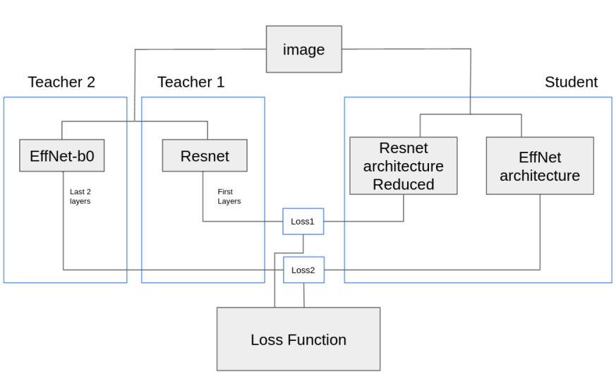

<p align="center">
  <h1><center> MixedTeacher </center></h1>
</p>

## Official implementation of the paper : "MixedTeacher : Knowledge Distillation for fast inference textural anomaly detection"
Article : https://arxiv.org/pdf/2109.15222.pdf


<p align="center">
  
</p>


## Getting Started

You will need [Python 3.10+](https://www.python.org/downloads) and the packages specified in _requirements.txt_.

Install packages with:

```
$ pip install -r requirements.txt
```

## Configure and Run
To run the code, please download the MVTEC AD dataset and place it in dataset/MVTEC  
Link to download the dataset : https://www.mvtec.com/company/research/datasets/mvtec-ad 

To run train and test the model : 
```
python trainMixed.py --obj tile 
```
You can modify hyperparameters directly in the trainDistillation.py and trainMixed.py files
To train a single model, you can use the file trainDistillation.py

## Citation
Please cite our paper in your publications if it helps your research. Even if it does not, you are welcome to cite us.

        @inproceedings {thomine2023mixedteacher,
        title={MixedTeacher: Knowledge Distillation for fast inference textural anomaly detection},
        author={Thomine, Simon and Snoussi, Hichem and Soua, Mahmoud},
        booktitle={2023 International Conference on Computer Vision Theory and Applications (VISAPP 2023)},
        year={2023}
        }

## License

This project is licensed under the MIT License.